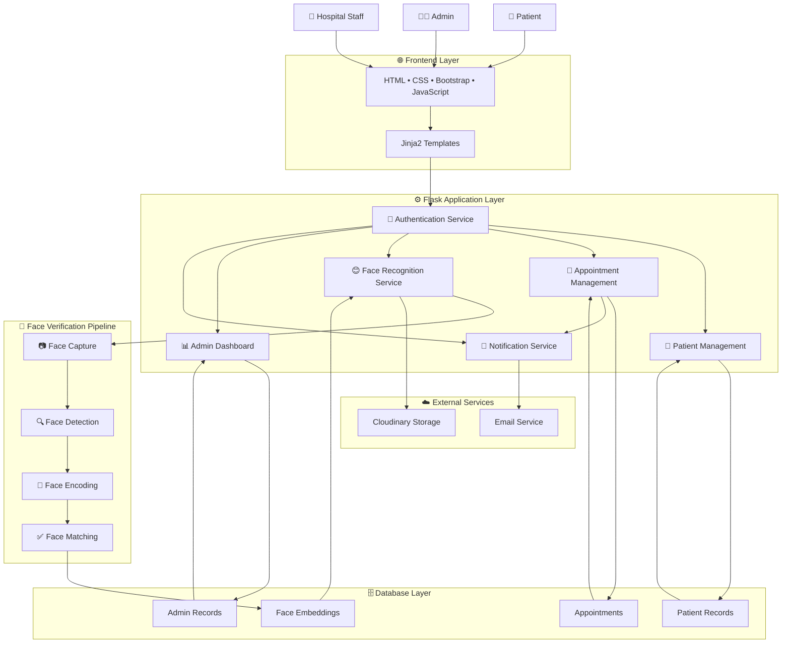

#"this is caresync project"
https://caresync-hospital-management-system-2.onrender.com

```mermaid
flowchart TB

    %% Users
    Patient["👤 Patient"]
    Admin["👨‍💼 Admin"]
    Staff["🏥 Hospital Staff"]

    %% Frontend
    subgraph Frontend["🌐 Frontend Layer"]
        UI["HTML • CSS • Bootstrap • JavaScript"]
        Templates["Jinja2 Templates"]
    end

    %% Backend
    subgraph Backend["⚙️ Flask Application Layer"]
        Auth["🔐 Authentication Service"]
        PatientMgmt["🧑 Patient Management"]
        Appointment["📅 Appointment Management"]
        Face["😊 Face Recognition Service"]
        AdminPanel["📊 Admin Dashboard"]
        Email["📧 Notification Service"]
    end

    %% Face Recognition Pipeline
    subgraph FacePipeline["🤖 Face Verification Pipeline"]
        Capture["📷 Face Capture"]
        Detect["🔍 Face Detection"]
        Encode["🧠 Face Encoding"]
        Match["✅ Face Matching"]
    end

    %% Database
    subgraph Database["🗄️ Database Layer"]
        UsersDB["Patient Records"]
        AppDB["Appointments"]
        FaceDB["Face Embeddings"]
        AdminDB["Admin Records"]
    end

    %% External Services
    subgraph External["☁️ External Services"]
        Cloudinary["Cloudinary Storage"]
        SMTP["Email Service"]
    end

    %% User Flow
    Patient --> UI
    Admin --> UI
    Staff --> UI

    UI --> Templates
    Templates --> Auth

    Auth --> PatientMgmt
    Auth --> Appointment
    Auth --> Face
    Auth --> AdminPanel

    %% Face Flow
    Face --> Capture
    Capture --> Detect
    Detect --> Encode
    Encode --> Match
    Match --> FaceDB

    %% Database Connections
    PatientMgmt --> UsersDB
    Appointment --> AppDB
    AdminPanel --> AdminDB

    %% External Connections
    Face --> Cloudinary
    Email --> SMTP

    Appointment --> Email
    Auth --> Email

    %% Return Flow
    UsersDB --> PatientMgmt
    AppDB --> Appointment
    FaceDB --> Face
    AdminDB --> AdminPanel
```