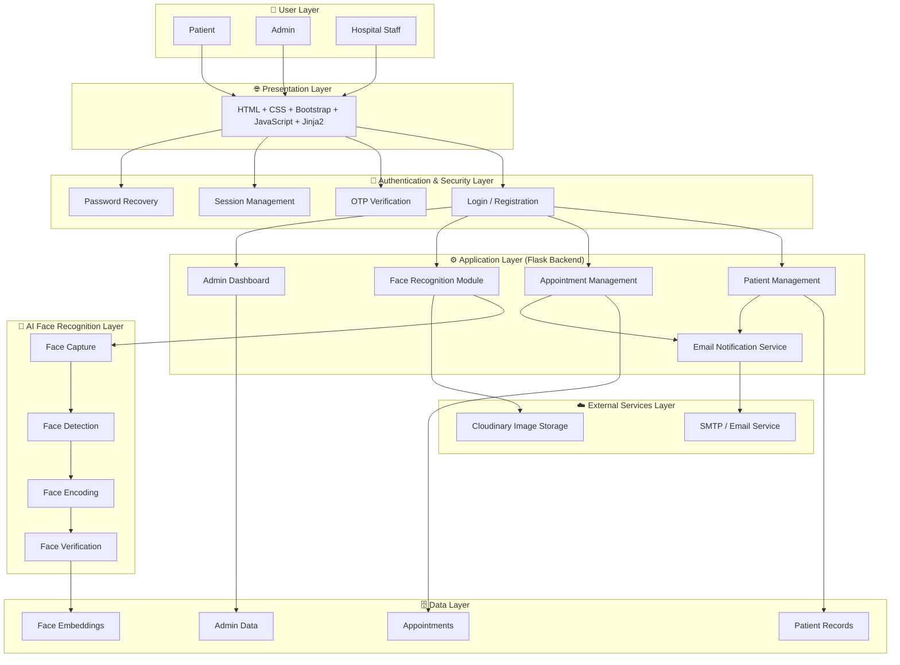
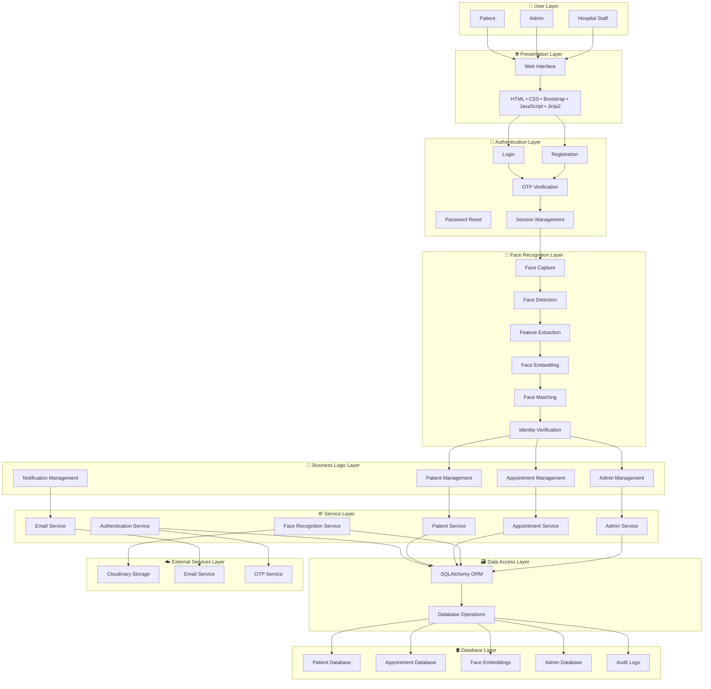

#"this is caresync project"
https://caresync-hospital-management-system-2.onrender.com

| Layer                | Technology                               |
| -------------------- | ---------------------------------------- |
| User Layer           | Patient, Admin, Hospital Staff           |
| Presentation Layer   | HTML, CSS, Bootstrap, JavaScript, Jinja2 |
| Authentication Layer | Flask Sessions, OTP, Password Recovery   |
| Application Layer    | Python, Flask, Blueprints                |
| AI Layer             | OpenCV, face_recognition, NumPy          |
| Data Layer           | SQLite / PostgreSQL, SQLAlchemy          |
| External Services    | Cloudinary, SMTP Email Service           |
| Deployment Layer     | Render, Gunicorn                         |
