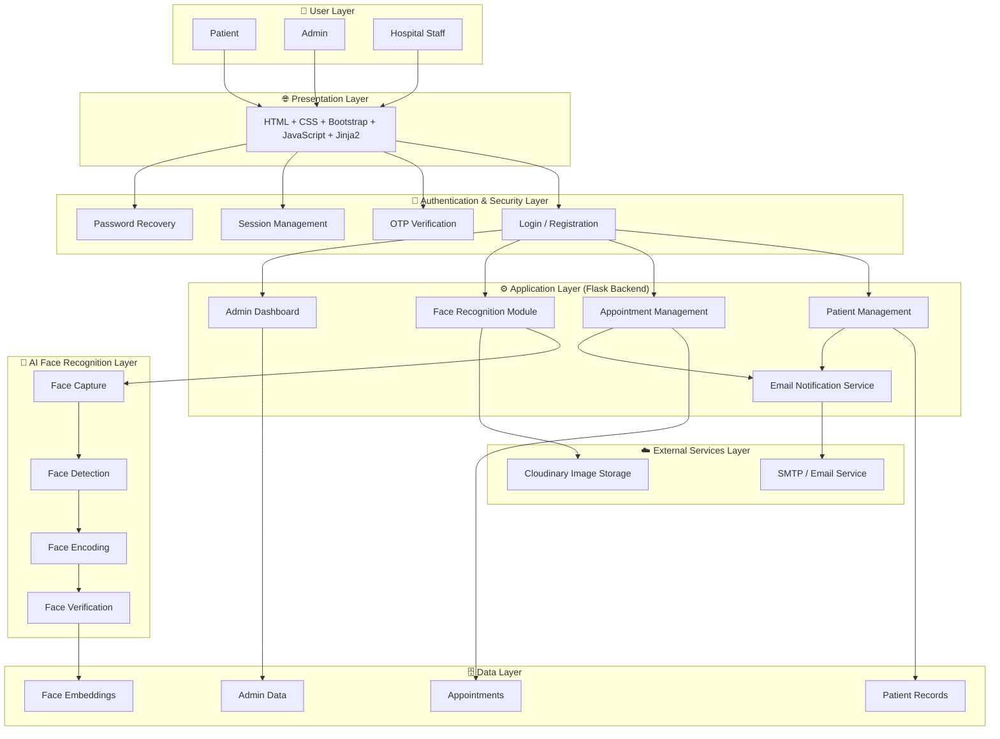
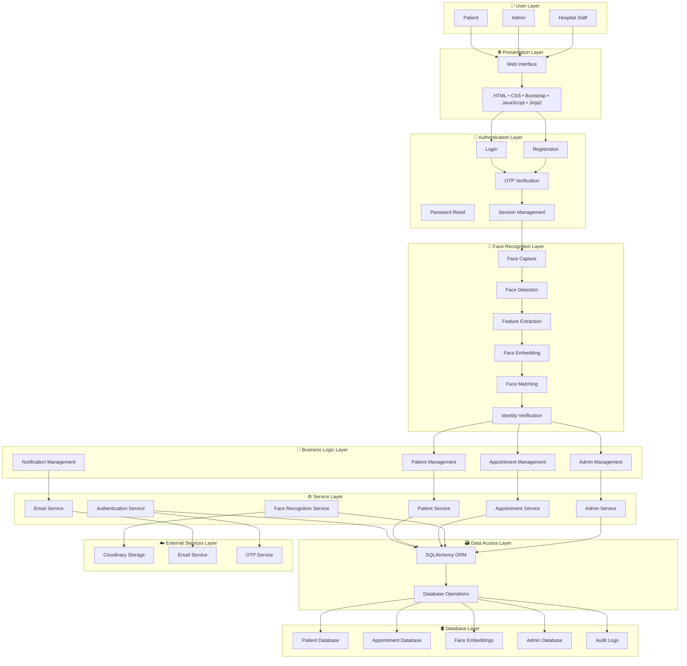

#"this is caresync project"
https://caresync-hospital-management-system-2.onrender.com







| Layer                | Technology                               |
| -------------------- | ---------------------------------------- |
| User Layer           | Patient, Admin, Hospital Staff           |
| Presentation Layer   | HTML, CSS, Bootstrap, JavaScript, Jinja2 |
| Authentication Layer | Flask Sessions, OTP, Password Recovery   |
| Application Layer    | Python, Flask, Blueprints                |
| AI Layer             | OpenCV, face_recognition, NumPy          |
| Data Layer           | SQLite / PostgreSQL, SQLAlchemy          |
| External Services    | Cloudinary, SMTP Email Service           |
| Deployment Layer     | Render, Gunicorn                         |


# 🏥 CareSync – Smart Hospital Management System with Face Recognition

CareSync is a secure hospital management and appointment booking platform that combines traditional patient management with AI-powered face recognition. The system enables patients to register, verify their identity through facial authentication, book appointments, and manage healthcare interactions efficiently while providing administrators with tools to monitor and manage hospital operations.

---

## 🌐 Live Demo

🔗 Live Application: https://caresync-hospital-management-system-2.onrender.com

🔗 GitHub Repository: https://github.com/ummaurya2005/CareSync-Hospital-Management-system

---

## 📌 Problem Statement

Traditional hospital appointment systems often face challenges such as:

* Manual patient verification
* Long waiting times
* Duplicate patient records
* Inefficient appointment management
* Weak authentication mechanisms
* Administrative overhead

CareSync addresses these issues by integrating face recognition technology with a hospital appointment management system.

---

## 🚀 Key Features

### 👤 Patient Features

* Patient Registration
* Secure Login
* Face Enrollment
* Face Verification
* Profile Management
* Appointment Booking
* Appointment Tracking
* Appointment History
* Password Reset via Email

### 🛡️ Security Features

* Password Hashing
* OTP Verification
* Face-Based Authentication
* Secure Session Management
* Role-Based Access Control
* HTTPS Deployment

### 👨‍💼 Admin Features

* Admin Login
* User Verification
* Appointment Monitoring
* Patient Management
* Dashboard Analytics
* Report Monitoring

### 🤖 AI Features

* Face Detection
* Face Encoding
* Face Matching
* Identity Verification
* Secure Patient Authentication

---

# 🏗️ System Architecture

The application follows a layered architecture design.

## 1. User Layer

* Patient
* Admin
* Hospital Staff

## 2. Presentation Layer

* HTML5
* CSS3
* Bootstrap
* JavaScript
* Jinja2 Templates

## 3. Authentication Layer

* Login
* Registration
* OTP Verification
* Password Recovery
* Session Management

## 4. Face Recognition Layer

* Face Capture
* Face Detection
* Feature Extraction
* Face Embedding Generation
* Face Matching
* Identity Verification

## 5. Business Logic Layer

* Patient Management
* Appointment Management
* Admin Management
* Notification Management

## 6. Service Layer

* Authentication Service
* Patient Service
* Appointment Service
* Face Recognition Service
* Email Service

## 7. Data Layer

* Patient Records
* Appointment Records
* Face Embeddings
* Admin Records
* Audit Logs

## 8. External Services Layer

* Cloudinary Image Storage
* Email Services
* OTP Services

---

# 🔄 Application Workflow

### Patient Registration Flow

Patient Registration
→ Email Verification
→ Face Enrollment
→ Database Storage
→ Account Creation

### Authentication Flow

Login
→ Credential Validation
→ OTP Verification
→ Session Creation
→ Dashboard Access

### Face Verification Flow

Capture Face
→ Detect Face
→ Extract Features
→ Generate Embedding
→ Match Stored Embedding
→ Verify Identity

### Appointment Booking Flow

Select Doctor
→ Select Date & Time
→ Enter Details
→ Confirm Appointment
→ Store in Database
→ Email Confirmation

---

# 🧠 Face Recognition Pipeline

1. User uploads or captures an image.
2. Face detection identifies the facial region.
3. Facial embeddings are generated.
4. Stored embeddings are retrieved.
5. Similarity comparison is performed.
6. Identity is verified.
7. Access is granted or denied.

---

# 🛠️ Technology Stack

## Frontend

* HTML5
* CSS3
* Bootstrap
* JavaScript
* Jinja2

## Backend

* Python
* Flask
* Flask Blueprints
* REST Architecture

## AI / Face Recognition

* OpenCV
* face_recognition
* NumPy

## Database

* SQLite
* SQLAlchemy ORM

## Cloud Services

* Cloudinary

## Email Services

* SMTP
* Flask-Mail

## Deployment

* Render
* Gunicorn

---

# 📂 Project Structure

```text
CareSync
├── Frontend
├── Authentication Module
├── Face Recognition Module
├── Appointment Module
├── Patient Module
├── Admin Module
├── Notification Module
├── Database Layer
└── External Services
```

---

# 🔒 Security Measures

* Password Hashing using Werkzeug
* OTP-based Verification
* Face Authentication
* Secure Session Handling
* Role-Based Access Control
* HTTPS Communication

---

# 📈 Future Enhancements

* Doctor Dashboard
* Online Payments
* Electronic Health Records (EHR)
* AI-based Appointment Recommendations
* Telemedicine Support
* Multi-Hospital Integration
* Mobile Application

---

# 👨‍💻 Author

Uttam Maurya

B.Tech Computer Science Engineering

Pranveer Singh Institute of Technology (PSIT)

---

## ⭐ If you found this project useful, consider giving it a star.
